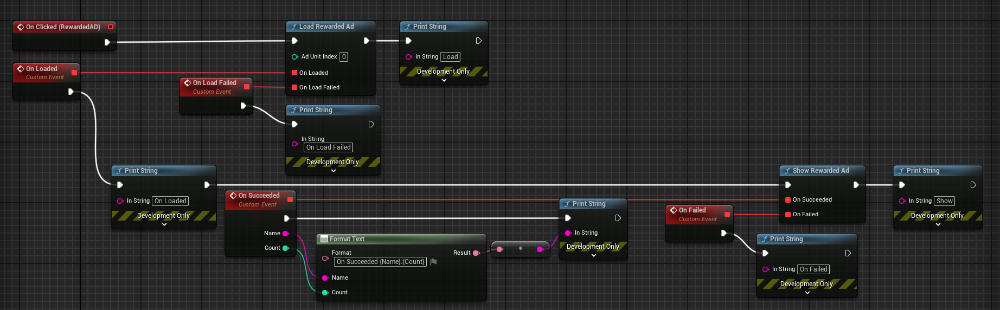
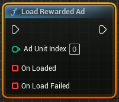
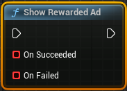
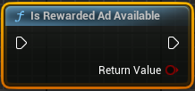

# How to use the Android Rewarded Ad Helper Plugin?



1. Turn off your unreal engine editor.
2. Add this plugin to `[YourProject]/Plugins` folder.
3. Rebuild unreal project by clicking on the .uproject file.
4. Add Below codes to `[YourProject]/Source/[YourProject].Target.cs`
```csharp
if (Target.Platform == UnrealTargetPlatform.Android)
{
	ExtraModuleNames.Add("OnlineSubsystem");
	ExtraModuleNames.Add("OnlineSubsystemGooglePlay");
	ExtraModuleNames.Add("AndroidAdvertising");
}
```

# Specifications
- This plugin is optimized for Unreal Engine 5.2.1.

# References

### Load Rewarded Ad
- Call when you want to load Rewarded Ad. 



### Show Rewarded Ad
- Call after On Loaded delegate of the Load Rewarded Ad node being called



### Is Rewarded Ad Available
- Check that Rewarded Ad is ready to show

